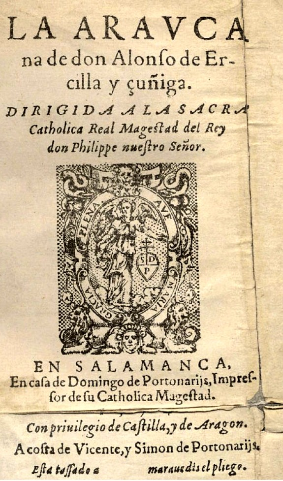

# Introducción {-}

En la era digital, los datos textuales se producen en cantidades inconmensurables, sean estos de origen digital o no. Diversas disciplinas fundamentan sus investigaciones en datos textuales. En este sentido, las humanidades no han experimentado un cambio, puesto que, desde siempre los datos textuales, o simplemente el texto, han sido la materia prima de los estudiosos de esta disciplina.
Sin embargo, pese a conservar su materia de estudio intacta, la llegada de las computadoras presentó, inevitablemente, desafíos y posibilidades en cuanto a la colecta,  constitución y análisis de datos, o más bien dicho de los corpus de estudio. 
Un corpus lingüístico, que es el tipo de corpus del que nos ocuparemos en este documento, requiere del trabajo de filólogos en la colecta, transcripción y edición de datos y del uso de ciertas herramientas informáticas destinadas a la presentación de los documentos editados.   
En la imagen debajo vemos la reproducción de un documento que hace parte del corpus COSUIZA:  
</br>

<center>
<div class="figura">

<p class="caption"> <a href="https://www.patrinum.ch/record/279315?ln=fr#bfe_isadg_full" target="_blank">Fonds Carlos de Goyeneche y Silvela, marquis de Balbueno, IS 5318/1/3/23</a> </p>
</div>
</center>
</br>
¿Cómo podemos hacer de este documento una fuente de datos susceptibles de almacenarse, transportarse y  hacer parte de un corpus en el cual puedan realizarse búsquedas específicas?, pero, además, ¿cómo podemos transcribir y presentar fielmente su estructura?
Más allá de la etapa evidente de la captura de la imagen, nos debemos plantear la cuestión de cómo extraer el texto que contiene el facsímil. Esto lo hacemos transcribiendo, pero para ello debemos determinar las herramientas que nos van a permitir producir esta transcripción. Existen programas, que muy frecuentemente exigen una subscripción para usarlos,
y permiten transcribir documentos manuscritos de manera automática, por ejemplo,
<a href="https://aws.amazon.com/fr/textract/" target="_blank">Textract</a> de la compañía Amazon. Pero esta etapa constituye solamente una parte del proceso de preparación de un corpus lingüístico digital.  En la actualidad, las transcripciones de textos manuscritos se deben realizar teniendo en consideración que estas serán publicadas empleando herramientas informáticas, lo que supone, desde luego, que estén codificadas de modo que puedan ser legibles por las computadoras. 

## La codificación de textos {-}
En rigor, el texto que leemos en este documento está codificado, de otro modo el computador, que solamente “habla” binario, no podría presentar los caracteres de nuestra lengua. Para la computadora, la palabra *español* equivale a la secuencia <span class="emph">\\x65\\x73\\x70\\x61\\xc3\\xb1\\x6f\\x6c</span> en el sistema de codificación UTF-8. Esta codificación, muy cercana a la lengua de la computadora y no fácilmente legible por los seres humanos (o al menos para la mayoría), es la que permite obtener texto plano o texto sin formato. Ahora bien, sabemos que las características textuales y estructurales de los documentos provenientes de las humanidades son diversas. Volvamos al documento presentado más arriba: podemos observar columnas, títulos subrayados, signos, etcétera.  Una alternativa sería, simplemente, transcribir este documento en un procesador de texto como Word y aplicar algunos estilos tipográficos. Sin embargo, esta opción es restrictiva, no solamente por el hecho de que Word es un programa que exige una licencia, sino porque, además, este no asegura la interoperabilidad imprescindible para el intercambio de datos. Pero por sobre todo, los estilos tipográficos no incluyen información semántica. Somos los seres humanos quienes tenemos la capacidad de interpretar el contenido semántico de los estilos tipográficos. Esto es posible gracias a una serie de convenciones, por ejemplo, el uso de cursivas para las citas, diferencias de tamaño de la fuente para las distintas partes de un texto, etcétera. Sin embargo, cuando un texto circula entre dispositivos, es muy probable que esta información se pierda.

### XML {-}
Una solución al problema de la codificación de textos fue propuesta hace bastante tiempo con la creación del metalenguaje de marcado XML, sigla de eXtensible Markup Language. XML es un estándar que permite la estructuración y transmisión de información a través de un sistema de etiquetas que se extienden en una estructura de subordinación. La cantidad de etiquetas que componen un documento es variable y no es forzosamente permanente, característica que explica el adjetivo <i>eXtensible</i>.
Las ventajas que se pueden encontrar haciendo uso de XML como medio para estructurar datos son múltiples. Primeramente, XML no es solamente legible por las computadoras, sino también por los seres humanos. Es una herramienta que existe desde hace más de cuarenta años, razón por la cual podemos estar seguros de que no caerá repentinamente en desuso. Es particularmente adecuada para la estructuración de datos textuales que no se adaptan a un modelo tabular.  
Un archivo en formato XML se estructura como vemos en el cuadro debajo. Un elemento raíz (root) contiene todos los elementos y subelementos. La cantidad de niveles no tiene restricción más allá de los evidentes problemas de legibilidad que conlleva un documento con excesivos niveles de anidación. 
``` xml
<raíz>
  <elemento>
    <subelemento>...Datos...</subelemento>
  </elemento>
</raíz>
```

Un elemento puede contener atributos, cuya utilidad es aportar información descriptiva sobre el elemento en el que aparece, dicho de otro modo, contiene datos sobre los metadatos. El valor de un atributo debe ir siempre entre comillas como vemos en el cuadro a continuación:

``` xml
<elemento id="20">...Datos...</elemento>
```
Estos principios constituyen el fundamento de la <a href="https://tei-c.org/" target="_blank">TEI</a> (Text encoding initiative) dado que esta es una aplicación del 
metalenguaje de marcado XML.  

### TEI {-}
TEI es una sigla que hace referencia al consorcio de la <i>Iniciativa para la codificación de textos</i> (Text Encoding Initiative) que nació a finales de la década de 1980 con el fin de establecer una metodología para la codificación informática de textos de carácter humanístico. La TEI representa, en la actualidad, el proyecto más longevo y exitoso de las humanidades digitales.
El consorcio TEI desarrolló un sistema de etiquetado, basado en XML, que permite agregar al texto plano marcas o anotaciones con información relativa a la estructura y contenido semántico de un texto. 
Dicho de otro modo, TEI puede entenderse como una colección de etiquetas con relaciones jerárquicas. Esta colección de etiquetas está orientada a representar textos procedentes de las humanidades: obras no literarias y literarias de todo género, manuscritas o impresas. 
Para cada documento, y en función de sus características textuales, TEI concibe diferentes módulos. Por ejemplo, para la descripción de manuscritos podemos recurrir a la etiqueta <span class="emph-code"> \<foliation\> </span> que nos permite describir la numeración de los folios de un manuscrito.  
Las directrices o, mejor dicho, recomendaciones (puesto que no han sido concebidas como una normativa), pueden encontrarse en la página del consorcio. ^[<a href="https://tei-c.org/release/doc/tei-p5-doc/en/html/index.html" target="_blank">Directrices TEI</a>]  
Supongamos que formamos parte de un proyecto en el cual se ha decidido codificar diversas ediciones de *La Araucana*. Comenzaremos la codificación por la primera plana que vemos a continuación:
</br>  

<center>
<div class="figura">

<p class="caption"> </p>
</div>
</center>
</br>
Una manera de transcribir esta primera plana sería como hacemos en el cuadro debajo (ignoramos todos los elementos tipogáficos para los cuales existe una gran cantidad de elementos previstos por la TEI):
``` xml
<front>
  <titlePage>
    <docTitle>
      <titlePart type="main">LA ARAVCAna <choice><orig>ARAVCAna</orig><reg>Araucana</reg></choice>
      </titlePart>
    </docTitle>
    <byline>de don<docAuthor>
    <choice><orig>Alonſo</orig><reg>Alonso</reg> 
    de Ercilla y <choice><orig>çuñiga</orig><reg>Zúñiga</reg>.
    </docAuthor></byline> 
    <figure>
      <graphic url="https://es.wikipedia.org/wiki/Literatura_colonial_de_Chile#/media/Archivo:La_Araucana.jpg"/>
      <figDesc>Grabado del Ángel Gabriel</figDesc>
    </figure>
    <docImprint> 
       EN <pubPlace>SALAMANCA</pubPlace>
      En caſa de <name>Domingo de Portonarijs</name>, Impreſſor de ſu Catholica Mageſtad.
    </docImprint>
    <imprimatur>Con privilegio de Caſtilla, y de Aragon. A coſta de Vicente, y Simon de Portonarijs. Eſta taſſado a        <del><gap reason="illegible"></del> 
    marauedis el pliego.</imprimatur>
  </titlePage>
</front>
```
Esta brevísima transcripción nos permite constatar ciertos puntos antes mencionados en este tutorial:
<ul>
  <li>Un elemento engloba a todo el resto de los elementos, en este caso es el elemento <span class="emph-code"> \<front\> </span> cuya función es contener toda la información paratextual de un documento.</li>
  <li>Cada elemento tiene una etiqueta de apertura y una de cierre. La barra oblicua \/ indica el cierre de una etiqueta.</li>
  <li>Se puede, facultativamente, agregar atributos a los elementos. En este caso el elemento <span class="emph-code"> \<titlePart\> </span> tiene un atributo para especificar el título principal de un texto. En ciertos casos, podríamos encontrar un subtítulo explicativo o un título alternativo precedido por la conjuncion disyuntiva *o*, en cuyos casos el valor del atributo ```type``` debe ser ```"desc"``` y ```"alt"``` respectivamente.
  <li>Podemos constatar la finalidad para cual se ha concebido el sistema de codificación TEI en XML: la descripción detallada del texto.</li>
</ul>
Sin embargo, esta transcripción se encuentra fuera de contexto. El elemento <span class="emph-code"> \<front\> </span> no es el elemento raíz de un documento codificado en TEI.
El elemento raíz de un documento en TEI es <span class="emph-code"> \<TEI\></span>. Este siempre lleva dos elementos hijos, <span class="emph-code"> \<teiHeader\> </span>para los metadatos y <span class="emph-code"> \<text\> </span> para el texto en sí.  
TEI ha publicado cinco versiones de sus directrices. La más reciente es la quinta propuesta (P5), una publicación de más de mil páginas y casi seiscientas etiquetas. Esta información nos permite deducir que un texto puede ser exhaustivamente descrito en TEI. Ahora bien, esta exhaustividad dependerá de los requerimientos de cada proyecto de edición. En cambio, TEI exige una cantidad mínima de información en el encabezado (<span class="emph-code">\<teiHeader\></span>) para que un texto se considere codificado en TEI. 
</br>
```xml
<?xml version="1.0" encoding="UTF-8"?>
<TEI>
  <teiHeader>
      <fileDesc>
         <titleStmt>
            <title>Título</title>
         </titleStmt>
         <publicationStmt>
         </publicationStmt>
         <sourceDesc>
         </sourceDesc>
      </fileDesc>
  </teiHeader>
  <text>
      Texto
  </text>
</TEI>
```

Este documento contiene la información mínima requerida de una codificación en TEI. 
La primera línea es lo que comúnmente se conoce como la declaración XML que tiene como función proveer la versión de XML que se utiliza y el estándar de codificación de caracteres.
El <span class="emph-code"> \<teiHeader\> </span> puede contener cinco elementos hijos que describen el contexto de publicación de un documento. Pero solamente el elemento <span class="emph-code"> \<fileDesc\> </span> es obligatorio, este debe proveer la información relativa a la edición electrónica en al menos tres etiquetas enumeradas a continuación: 
 <ul>
<li><span class="emph-code"> \<titleStmt\></span>: proporciona la información relativa al título del documento y sus autores o responsables.</li>
<li><span class="emph-code"> \<publicationStmt\></span>: reúne la información acerca de la publicación del documento electrónico. Puede ser descrito simplemente en prosa en un elemento de párrafo ```<p>``` o se puede recurrir a elementos específicos como ```<pubPlace>``` o ```<Publisher>```. </li>
<li><span class="emph-code"> \<sourceDesc\></span>: contiene la información referente al documento que sirve de fuente para la edición electrónica. Al igual que el elemento precedente, este puede ser descrito en prosa o con elementos propios.</li>
</ul>
Como se ha mencionado previamente, la exhaustividad de la descripción con ayuda del estándar de marcación TEI depende de los requisitos de cada proyecto. En nuestro caso, haremos el examen detallado de la cabecera que utilizaremos para cada documento del COSUIZA en el último capítulo.


