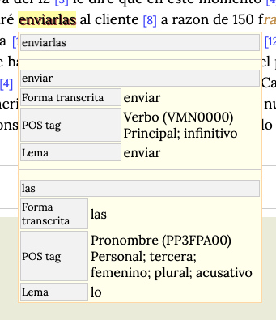
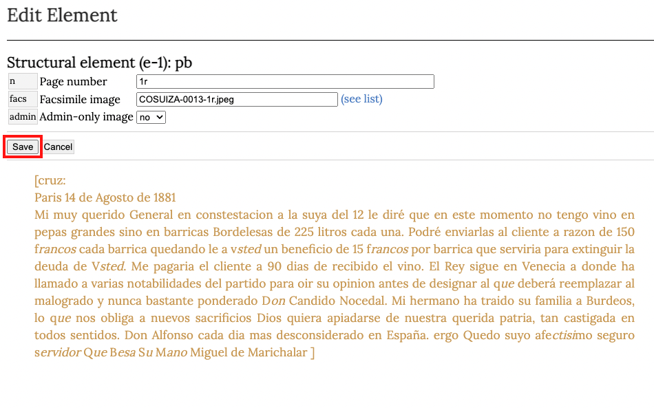

# Edición de textos en COSUIZA/Teitok {-}

En este capítulo presentaremos una guía detallada de los procedimientos de edición en la página del COSUIZA. 
Este capítulo se divide en tres apartados. En el primero se hace una presentación de las etiquetas que componen la cabecera de todos los documentos del corpus y un repertorio de las etiquetas aplicables al texto. El segundo expone las posibilidades de automatización que ofrece Teitok en el proceso de edición. Finalmente, el tercer apartado, ofrece una serie de videotutoriales que exponen el proceso de creación y edición de un documento en la página del COSUIZA. 

## Guía de etiquetado {-}

### Metadatos {-}

Como se ha indicado previamente, los metadatos se presentan dentro del elemento <span class="emph-code"> \<teiHeader\></span>. Esta sección puede ser muy sucinta o muy extensa dependiendo de los requerimientos del proyecto en el que se inscribe la edición. El <span class="emph-code">\<teiHeader\></span> del COSUIZA recoge los datos necesarios según los criterios de la red CHARTA y las exigencias de TEI. Este elemento, que de ahora en adelante llamaremos *cabecera* se compone de cuatro elementos hijos que detallamos a continuación:

1. <span class="emph-code"> \<fileDesc\> </span>
2. <span class="emph-code"> \<encodingDesc\> </span>
3. <span class="emph-code"> \<profileDesc\> </span>
4. <span class="emph-code"> \<revisionDesc\> </span>


#### 1. <span class="emph-code"> \<fileDesc\> </span> {-}  

Contiene los elementos que proporcionan información bibliográfica del documento electrónico.   

##### 1.1 <span class="emph-code"> \<titleStmt\> </span> {-}  
El enunciado de título ofrece la información relativa al título del documento electrónico y las personas u organismos responsables de su realización.

###### <a name="head1234"></a> 1.1.1  <span class="emph-code"> \<title\> </span> {-}
Todos los documentos del COSUIZA llevan por título una secuencia alfanumérica como se ilustra en el ejemplo debajo:
```xml
<title>COSUIZA-0001</title>
```
###### 1.1.2 <span class="emph-code"> \<funder\> </span> {-} 
Ofrece la información sobre la institución o individuos que financian el proyecto. Para todos los documentos del COSUIZA el contenido de este elemento es el mismo:
```xml
<funder>Universidad de Lausana</funder>
```
###### 1.1.3 <span class="emph-code"> \<respStmt\> </span> {-} 
El enunciado de responsabilidad provee información sobre las personas que han participado en la producción del documento electrónico, también se precisa el rol de cada una. Se deben distinguir tres roles de acuerdo a los criterios de edición CHARTA y uno específico a la producción del documento electrónico. Cada uno de estos enunciados de responsabilidad contienen un elemento <span class="emph-code">\<resp\></span> con un atributo para especificar si se trata del transcriptor, los revisores o el encargado de producir el documento XML y un elemento <span class="emph-code">\<name\></span> para identificar a la persona encargada de la función correspondiente. Se deben completar solamente los nombres que correspondan en la etiqueta <span class="emph-code">\<name\></span>, el resto es invariable.

```xml
<respStmt> 
            <resp resp="transcriber">Transcriptor</resp> 
            <name>Nombre del transcriptor</name> 
         </respStmt>
         <respStmt>
            <resp resp="reviewer1">Revisor 1</resp>
            <name>Nombre del revisor 1</name>
         </respStmt>
         <respStmt>
            <resp resp="reviewer2">Revisor 2</resp>
            <name>Nombre del revisor 2</name>
         </respStmt>
         <respStmt>
            <resp resp="XMLconverter">Conversor a XML</resp>
            <name>Nombre del conversor a XML</name>
</respStmt>
```

##### 1.2 <span class="emph-code"> \<publicationStmt\> </span> {-} 
Proporciona los datos relativos a la publicación y distribución del documento electrónico.

###### 1.2.1 <span class="emph-code"> \<publisher\> </span> {-} 
Contiene la información sobre la organización responsable de la publicación del documento. En nuestra cabecera encontramos dos elementos <span class="emph-code"> \<orgName\> </span> para proporcionar el nombre del grupo GRAFILA (Grupo de Análisis Filológico de Lausana) —acrónimo del grupo de estudio miembro de la red CHARTA— y el de la UNIL. El tipo de institución se detalla con ayuda del atributo ```type```. Para el COSUIZA estos elementos y sus atributos son inmutables:
```xml
<publisher>
    <orgName type="group">GRAFILA</orgName> 
    <orgName type="institution">Universidad de Lausana</orgName>
</publisher>
```
###### 1.2.2 <span class="emph-code"> \<pubPlace\> </span> {-} 
Contiene el nombre del lugar de publicación del documento electrónico. Para todos los documentos del corpus este elemento tiene el mismo contenido:
```xml
<pubPlace>Lausana</pubPlace> 
```

###### 1.2.3 <span class="emph-code"> \<idno\> </span> {-} 
Este elemento aparece dos veces en la cabecera y está destinado a identificar el corpus y el número del documento dentro del corpus. Estas informaciones son de utilidad para el macrocorpus CHARTA en el proceso de integración de los documentos de todos sus subcorpus. El contenido de la primera etiqueta es invariable a diferencia del número identificador:
```xml
<idno type="corpus">COSUIZA</idno>
<idno type="corpus-num">Número identificador</idno>
```

###### 1.2.4 <span class="emph-code"> \<distributor\> </span> {-} 
Recoge la información sobre el o los organismos responsables de la distribución del documento. En nuestra cabecera permanece invariable:
```xml
<distributor>Universidad de Lausana</distributor>
```

###### 1.2.5 <span class="emph-code"> \<availability\> </span> {-} 
Proporciona la información relativa a la disponibilidad o restricción de publicación de un documento. Dada la naturaleza de los documentos que hacen parte del COSUIZA, en la mayoría de los casos el contenido de esta etiqueta será el mismo. Ahora bien, si se tratara de un documento sobre el cual se aplican ciertos derechos o reservas deberá ser señalado en esta sección. Para todo el resto de los documentos, este elemento se presenta dentro de una etiqueta *párrafo* (<span class="emph-code">\<p\></span>) como se muestra a continuación: 
```xml
<availability>
    <p>Licencia CREATIVE COMMONS</p>
</availability> 
```

##### 1.3 <span class="emph-code"> \<sourceDesc\> </span> {-} 
Suministra la información sobre el documento original que sirve de fuente para la edición digital.
En virtud de que todos los documentos originales son manuscritos, vamos a utilizar la etiqueta <span class="emph-code"> \<msDesc\></span> concebida para describir documentos de este tipo.

###### 1.3.1 <span class="emph-code"> \<msDesc\> </span> {-} 

<span class="subdivision">1.3.1.1 </span> <span class="emph-code"> \<msIdentifier\> </span>
Este elemento contiene todas las etiquetas destinadas a identificar la ubicación exacta de un manuscrito. Vamos a indicar el país, el cantón, la ciudad, el nombre del archivo y el identificador dentro del archivo. El único elemento que no varía es el país, como podemos ver debajo:
```xml
<msIdentifier>
    <country>Suiza</country>
    <region type="canton">Cantón en donde se conserva el documento</region> 
    <settlement>Ciudad en donde se conserva el documento</settlement> 
    <repository>Archivo en donde se conserva el documento</repository> 
    <idno>Identificador dentro del archivo</idno> 
</msIdentifier>
```
En caso de que el documento electrónico tenga como fuente el fragmento de un manuscrito se deben indicar los folios (f o ff.) dentro de la etiqueta <span class="emph-code"> \<idno\></span>.

<span class="subdivision">1.3.1.2 </span> <span class="emph-code">  \<msContents\> </span> Esta etiqueta nos permite describir los contenidos del manuscrito. Incluiremos el resumen que hace parte de todas las cabeceras de las ediciones CHARTA, además señalaremos si se trata de una copia o de un original en el valor del atributo ```class``` del elemento <span class="emph-code">  \<msItem\></span>, el nombre del <i>scriptor</i>, en caso de conocer su nombre, y añadiremos su tipo en el atributo ```type``` con el valor que corresponda:
```xml
<msContents> 
  <summary>Resumen del contenido</summary> 
  <msItem class="original/copia">
    <editor>
      <persName type="escribano/notario">Nombre del scriptor</persName> 
    </editor>
  </msItem>
</msContents>
```

<span class="subdivision">1.3.1.3 </span> <span class="emph-code"> \<physDesc\> </span>
Proporciona la información respecto de las características físicas del documento fuente. Este elemento contiene tres etiquetas mayores:   
-   <span class="emph-code"> \<objectDesc\> </span> En donde incluiremos los elementos relativos a las medidas del documento y su estado de conservación. En la mayoría de los casos los atributos de los elementos son invariables.  
-   <span class="emph-code"> \<handDesc\></span> En donde identificaremos y describiremos la o las manos presentes en el manuscrito.  En nuestro ejemplo vamos a suponer que existen dos manos en el manuscrito, una de ellas será la preponderante (<i>major</i>) y, la otra, la secundaria (<i>minor</i>).  
-     <span class="emph-code"> \<bindingDesc\></span> En donde podemos describir la encuadernación.
```xml
<physDesc>
  <objectDesc form="ms">
    <supportDesc material="papel">
        <extent>
          <note>Descripción en prosa del manuscrito</note> 
          <dimensions scope="all" unit="mm">
              <height></height> 
              <width></width> 
          </dimensions>
        </extent>
        <condition><p>Estado de conservación</p></condition> 
    </supportDesc>
  </objectDesc>
  <handDesc hands="2">
    <handNote resp="#h1" scope="major"><p>Descripción de la mano 1</p></handNote>
    <handNote resp="#h2" scope="major"><p>Descripción de la mano 2</p></handNote> 
  </handDesc>
  <bindingDesc> 
    <binding><p>Descripción en prosa de la encuadernación</p></binding> 
  </bindingDesc>
</physDesc>
```

<span class="subdivision">1.3.1.4 </span> <span class="emph-code"> \<history\> </span> Etiqueta que contiene la información sobre la historia del manuscrito.
Usaremos la etiqueta <span class="emph-code"> \<origin\></span> para  incluir los elementos específicos a la fecha y locación originales del manuscrito. Todos los atributos son invariables, con la excepción del atributo ```when```.
```xml
<history> 
  <origin> 
    <origDate when="1688-11-12" type="explicit">1688 noviembre 12</origDate>
    <origPlace type="explicit">
      <placeName type="settlement">Valladolid</placeName> 
      <region type="region">Valladolid</region> 
      <country>España</country> 
      <geo>41.651981 -4.728561</geo> 
    </origPlace>
  </origin>
</history>
```
El atributo ```when```debe tener como valor la fecha en formato  ```aaaa-mm-dd```. El contenido del elemento <span class="emph-code"> \<geo\></span> permite la geovisualización de los documentos en la plataforma Teitok. Para lograr la correcta distribución de los documentos en el mapa, es imprescindible estandardizar las coordenadas geográficas de las diferentes localidades representadas en el mapa. Para acceder al repertorio de coordenadas del COSUIZA pinchar [aquí](https://github.com/aescocasti/pro_bookdown/raw/master/coordenadas.xlsx.zip). En los casos en donde solo se sepa el país de origen del documento, el repertorio de coordenadas se encuentra en  [este](https://github.com/aescocasti/pro_bookdown/raw/master/coordenadas_paises.xlsx.zip) enlace. En el supuesto de que una localidad o país no se hallaren en el repertorio se debe contactar al administrador de la página del COSUIZA.


#### 2. <span class="emph-code"> \<encodingDesc\> </span> {-}
Elemento que permite describir los fundamentos editoriales sobre los cuales se ha realizado la edición del documento.  

##### 2.1 <span class="emph-code"> \<projectDesc\> </span> {-} 
Ofrece las razones por las cuales se ha realizado la codificación del documento. Se trata de una descripción somera dentro de un elemento *párrafo* (<span class="emph-code">\<p\></span>). El contenido será el mismo para todos los documentos del COSUIZA:
```xml
<projectDesc> 
  <p>Edición electrónica preparada para la investigación CHARTA-TEI</p>
</projectDesc>
```
##### 2.2 <span class="emph-code"> \<editorialDecl\> </span> {-}  
Contiene los detalles de los principios editoriales aplicados en la codificación del documento. Su contenido se precisa en un elemento *párrafo* (<span class="emph-code">\<p\></span>) y es idéntico en todos los documentos del COSUIZA:
```xml
<editorialDecl> 
  <p>Este documento sigue los criterios de edición CHARTA adaptados para el estándar internacional de marcación electrónica TEI http://www.tei-c.org/index.xml.</p>
</editorialDecl>
```

##### 2.3 <span class="emph-code"> \<classDecl\> </span> {-} 
En este elemento se incluye la tipología documental propuesta en los criterios CHARTA.^[Ver tipología documental en el <a href="http://files.redcharta1.webnode.es/200000025-edbc7eeb54/Propuesta%20tipolog%C3%ADa%20documental%20CHARTA%20(1).pdf" target="_blank">enlace</a>] Este elemento es invariable y debe estar presente en todos las ediciones electrónicas, puesto que sirve como fuente de la categoría de documento que se señalará posteriormente en la cabecera. Dada la extensión de esta clasificación, se expone solamente un extracto a continuación:  
```xml
<classDecl> 
    <taxonomy xml:id="Tip-CH">
       <bibl>Tipología CHARTA, propuesta de octubre de 2013</bibl> 
       <category xml:id="tex-leg"> 
          <category xml:id="tex-leg-ord">
             <catDesc>Ordenanzas</catDesc>
          </category>
          <category xml:id="tex-leg-fue">
             <catDesc>Fueros</catDesc>
          </category>
          <category xml:id="tex-leg-pri">
             <catDesc>Privilegios</catDesc>
          </category>
          <category xml:id="tex-leg-cpue">
             <catDesc>Cartas pueblas</catDesc>
          </category>
          <category xml:id="tex-leg-pra">
             <catDesc>Pragmáticas</catDesc>
          </category>
       </category>
       <category xml:id="car-com"> 
          <category xml:id="car-com-con">
             <catDesc>Contratos</catDesc>
          </category>
          <category xml:id="car-com-com">
             <catDesc>Compraventas</catDesc>
          </category>
          <category xml:id="car-com-ces">
             <catDesc>Cesiones</catDesc>
          </category>
          <category xml:id="car-com-don">
             <catDesc>Donaciones</catDesc>
          </category>
          <category xml:id="car-com-conc">
             <catDesc>Conciertos</catDesc>
          </category>
          <category xml:id="car-com-acu">
             <catDesc>Acuerdos</catDesc>
          </category>
          <category xml:id="car-com-per">
             <catDesc>Permutas</catDesc>
          </category>
          <category xml:id="car-com-tru">
             <catDesc>Truques</catDesc>
          </category>
          <category xml:id="car-com-pac">
             <catDesc>Pactos</catDesc>
          </category>
          <category xml:id="car-com-int">
             <catDesc>Intercambios de bienes</catDesc>
          </category>
          <category xml:id="car-com-ccen">
             <catDesc>Cartas de censo</catDesc>
          </category>
       </category>
    </taxonomy>
 </classDecl>
```

#### 3. <span class="emph-code"> \<profileDesc\> </span> {-}
Elemento que se utiliza para indicar informaciones no bibliográficas del documento.

##### 3.1 <span class="emph-code"> \<langUsage\> </span> {-} 
Esta etiqueta contiene las lenguas utilizadas en el texto. Cada lengua se señala en un elemento <span class="emph-code"> \<language\> </span> que incluye el atributo ```ident``` para identificar el código de cada lengua. Este código proviene de la norma [ISO-639-1](https://fr.wikipedia.org/wiki/Liste_des_codes_ISO_639-1){target="_blank"}. La mayoría de los documentos del COSUIZA están escritos en castellano y para expresarlo usaremos el código *es*. En el ejemplo debajo vamos a suponer estamos frente a un documento en el cual se utilizan dos lenguas, una principal (*major*) y una secundaria (*minor*), la extensión de la utilización de cada una en el manuscrito se expresa en el atributo ```scope```, que permite expresar una noción de medida:

```xml
<langUsage type="hybrid">
  <language ident="es" scope="major">castellano</language>
  <language ident="fr" scope="minor">francés</language> 
</langUsage>
```
Cuando codifiquemos un documento con más de una lengua debemos precisarlo en el atributo ```type``` del elemento <span class="emph-code"> \<langUsage\> </span> con el valor <i>hybrid</i>. No incluiremos este atributo en los documentos monolingües.

##### 3.2 <span class="emph-code"> \<textClass\> </span> {-} 
Proporciona la información relativa a la clasificación del documento de acuerdo a una tipología o esquema establecidos. En esta sección recogeremos los identificadores correspondientes de la taxonomía CHARTA presentada previamente. También vamos a incluir las palabras clave propias de la cabecera CHARTA. Supongamos que estamos codificando un testamento, primero buscaremos la categoría <i>Testamento</i> en la taxonomía declarada más arriba y vamos a copiar el valor de su atributo ```xml:id``` que es: ```tes-inv-tes```. También vamos a incluir la supracategoría que contiene a <i>Testamento</i> como vemos en la figura debajo: 

<p align="center">
{width=60%} 
</p>

Se indica en primera posición la supracategoría y, luego, la subcategoría, cada una en un elemento <span class="emph-code"> \<catRef\> </span> y en el atributo target se debe escribir el identificador de la categoría antecedido por un signo almohadilla o numeral. La codificación de esta sección de un documento testamentario quedaría como vemos debajo:  
```xml
<textClass> 
  <catRef target="#tes-inv"/>
  <catRef target="#tes-inv-tes"/> 
  <keywords> 
    <term>Palabra clave 1</term>
    <term>Palabra clave 2</term>
    <term>Palabra clave 3</term>
    <term>etc</term>
  </keywords>
</textClass>
```

##### 3.3 <span class="emph-code"> \<particDesc\> </span> {-} 
Este elemento permite describir los participantes o interlocutores presentes en un texto. Esta sección solo debe utilizarse para ciertas categorías documentales como la correspondencia o, documentos reales en donde existen diversos roles y podemos diferenciar la autoría de la delegación y la escritura. Para cada rol o papel usaremos una etiqueta <span class="emph-code"> \<person\> </span> con un atributo ```rol``` cuyo valor va a depender de la categoría documental. En el ejemplo debajo vemos los roles que debemos especificar, en el caso de que sea posible identificar todos los roles,  en un documento real.

```xml
<particDesc> 
  <person role="author">
    <persName>Autor</persName>
  </person>
  <person role="ordered">
    <persName>Iussor</persName>
  </person>
  <person role="scriptor">
    <persName>Scriptor</persName>
  </person>
  <person role="signed">
    <persName>Firmante</persName>
  </person>
</particDesc>

```
En el caso de estar frente a un documento epistolar, se debe utilizar la secuencia a continuación, solamente si es posible identificar estos roles:
```xml
<particDesc> 
  <person role="sent">
    <persName>Emisor</persName>
  </person>
  <person role="received">
    <persName>Destinatario</persName>
  </person>
</particDesc>
```
##### 3.4 <span class="emph-code"> \<correspDesc\> </span> {-} 
Ofrece datos relativos a un documento epistolar. Esta sección debe ser utilizada solamente en la codificación de cartas. Se detalla el lugar de origen y destino además de sus coordenadas respectivas.
```xml
<correspDesc> 
  <correspAction type="sent"> 
    <settlement>
      <placeName>Origen</placeName>
      <geo>Coordenadas</geo>
    </settlement>
  </correspAction>
  <correspAction type="received"> 
    <settlement>
      <placeName>Origen</placeName>
      <geo>Coordenadas</geo>
    </settlement>
  </correspAction>
</correspDesc>
```

#### 4. <span class="emph-code"> \<revisionDesc\> </span> {-}
Este elemento permite registrar las modificaciones que se han hecho en el documento electrónico. Cada intervención se detalla en un elemento <span class="emph-code"> \<change\> </span> con un atributo ```when``` para precisar la fecha en que ha tenido lugar la modificación. En el COSUIZA detallaremos dos modificaciones principales: la creación del documento XML y la revisión de la presentación crítica. El atributo ```when```debe indicar la fecha de la modificación y se puede agregar el atributo ```who```para indicar las iniciales del colaborador que las ha llevado a cabo.


```xml
<revisionDesc> 
  <change when="aaa-mm-dd" who="MCL">Creación del archivo</change>
  <change when="aaa-mm-dd" who= "ECDA">Revisión final de la presentación crítica</change>
</revisionDesc>
```
### Texto {-}
<span class="emph-code"> \<text\></span> es el elemento que contiene los datos textuales en un documento TEI. Hemos señalado que en Teitok la cabecera se ajusta a los criterios de la TEI, sin embargo,  en lo que respecta al texto tiene su propio sistema basado en la *tokenización* de las palabras y de los signos de puntuación. En este sentido, en este tutorial nos limitaremos a presentar solamente los elementos editoriales que CHARTA ha adaptado para su migración a Teitok.

#### 1. Elementos codicológicos {-}

##### 1.1 Numeración de hoja, columna y línea {-}
###### <a name="head12345"></a> 1.1.1 Inicio de página {-}

<table id = "styled-table">
            <td>CHARTA</td>
            <td>CHARTA-TEITOK</td>
        </tr>
        <tr>
            <td>{h 1r}</td>
            <td><span style="color: #900C3F">\<pb</span> <span style="color: #E34234">n</span> <span style="color: gray">=</span> <span style="color: blue">"1r"</span> <span style="color: #E34234">facs</span> <span style="color: gray">=</span> <span style="color: blue">"COSUIZA-0014-1r.jpeg"</span> <span style="color: #E34234">id</span> <span style="color: gray">=</span> <span style="color: blue">"e-1"</span><span style="color: #900C3F">\/\></span></td>
        </tr>
        <tr>
            <td>{h 1v}</td>
            <td><span style="color: #900C3F">\<pb</span> <span style="color: #E34234">n</span> <span style="color: gray">=</span> <span style="color: blue">"1v"</span> <span style="color: #E34234">facs</span> <span style="color: gray">=</span> <span style="color: blue">"COSUIZA-0014-1v.jpeg"</span> <span style="color: #E34234">id</span> <span style="color: gray">=</span> <span style="color: blue">"e-23"</span><span style="color: #900C3F">\/\></span></td>
        </tr>
</table>
La etiqueta <span class="emph-code"> \<pb\> </span> indica el inicio de página. 
Es pertinente recordar que, conforme a los criterios CHARTA, todos los textos editados, aunque sean fragmentos de un manuscrito,  comienzan por la hoja 1. De modo que el atributo ```n``` (*número*), siempre comienza por el número 1. También consta de un atributo ```facs``` para precisar el nombre del archivo facsimilar. Para denominar los archivos de los facsímiles se utiliza el nombre del archivo XML seguido de un guión, la hoja y cara correspondiente: COSUIZA-XXXX-1r. El atributo ```ìd``` adjudica un identificador único al elemento <span class="emph-code">\<pb\></span>, este identificador es de la forma ```e-n°``` y, si bien no es aleatorio, no corresponde necesariamente al número de hoja. Veremos en la sección práctica de este documento que la plataforma de Teitok se encarga de adjudicar este identificador.

###### 1.1.2 Inicio de columna {-}
<table id = "styled-table">
            <td>CHARTA</td>
            <td>CHARTA-TEITOK</td>
        </tr>
        <tr>
            <td>{a}</td>
            <td><span style="color: #900C3F">\<cb</span> <span style="color: #E34234">n</span> <span style="color: gray">=</span> <span style="color: blue">"a"</span> <span style="color: #E34234">id</span> <span style="color: gray">=</span> <span style="color: blue">"e-9"</span><span style="color: #900C3F">\/\></span></td>
        </tr>
        <tr>
            <td>{h 1ra}</td>
            <td><span style="color: #900C3F">\<pb</span> <span style="color: #E34234">n</span> <span style="color: gray">=</span> <span style="color: blue">"1r"</span> <span style="color: #E34234">facs</span> <span style="color: gray">=</span> <span style="color: blue">"COSUIZA-0014-1r.jpeg"</span> <span style="color: #E34234">id</span> <span style="color: gray">=</span> <span style="color: blue">"e-1"</span><span style="color: #900C3F">\/\></span> <span style="color: #900C3F">\<cb</span> <span style="color: #E34234">n</span> <span style="color: gray">=</span> <span style="color: blue">"a"</span> <span style="color: #E34234">id</span> <span style="color: gray">=</span> <span style="color: blue">"e-9"</span><span style="color: #900C3F">\/\></span></td>
        </tr>
</table>
El inicio de columna se indica con la etiqueta <span class="emph-code">\<cb\></span>. Consta de un atributo ```n``` cuyo valor es la letra de la columna y un atributo ```id```. En la segunda línea de la tabla tenemos un inicio de página que coincide con el inicio de una columna, coincidencia muy frecuente en los manuscritos. Como vemos en la marcación CHARTA, página y columna se señalan en una misma secuencia entre llaves. Sin embargo, en la marcación CHARTA-TEITOK el inicio de página y el de columna se indican con etiquetas independientes no anidadas. 

###### 1.1.3 Inicio de línea {-}
<table id = "styled-table">
            <td>CHARTA</td>
            <td>CHARTA-TEITOK</td>
        </tr>
        <tr>
            <td>{1}</td>
            <td><span style="color: #900C3F">\<lb</span> <span style="color: #E34234">n</span> <span style="color: gray">=</span> <span style="color: blue">"1"</span> <span style="color: #E34234">id</span> <span style="color: gray">=</span> <span style="color: blue">"e-1"</span><span style="color: #900C3F">\/\></span></td>
</table>
Del mismo modo que los elementos precedentes, el cambio de línea contiene dos atributos: ```n```y ```id``` y, el identificador puede no coincidir con el número de línea.

###### 1.1.4 Cambio de línea en acotaciones marginales {-}
<table id = "styled-table">
            <td>CHARTA</td>
            <td>CHARTA-TEITOK</td>
        </tr>
        <tr>
            <td>|</td>
            <td><span style="color: #900C3F">\<lb</span> <span style="color: #E34234">id</span> <span style="color: gray">=</span> <span style="color: blue">"e-4"</span><span style="color: #900C3F">\/\></span></td>
</table>
El cambio de línea en el texto marginal se anota con un elemento <span class="emph-code"> \<lb\></span>, sin embargo, carece de atributo ```n```.

##### 1.2 Deterioro del original {-}
<table id = "styled-table">
            <td>CHARTA</td>
            <td>CHARTA-TEITOK</td>
        </tr>
        <tr>
            <td>[***]</td>
            <td><span style="color: #900C3F">\<gap</span> <span style="color: #E34234">reason</span> <span style="color: gray">=</span> <span style="color: blue">"ilegible"</span><span style="color: #900C3F">\/\></span></td>
        <tr>
            <td>*</td>
            <td><span style="color: #900C3F">\<gap</span> <span style="color: #E34234">reason</span> <span style="color: gray">=</span> <span style="color: blue">"ilegible"</span> <span style="color: #E34234">extent</span> <span style="color: gray">=</span> <span style="color: blue">"1 char"</span><span style="color: #900C3F">\/\></span></td>
       </tr>
       <tr>
            <td>**</td>
            <td><span style="color: #900C3F">\<gap</span> <span style="color: #E34234">reason</span> <span style="color: gray">=</span> <span style="color: blue">"ilegible"</span> <span style="color: #E34234">extent</span> <span style="color: gray">=</span> <span style="color: blue">"2 chars"</span><span style="color: #900C3F">\/\></span></td>
       </tr>
<tr>
            <td>***</td>
            <td><span style="color: #900C3F">\<gap</span> <span style="color: #E34234">reason</span> <span style="color: gray">=</span> <span style="color: blue">"ilegible"</span> <span style="color: #E34234">extent</span> <span style="color: gray">=</span> <span style="color: blue">"3 chars"</span><span style="color: #900C3F">\/\></span></td>
       </tr>
<tr>
            <td>****</td>
            <td><span style="color: #900C3F">\<gap</span> <span style="color: #E34234">reason</span> <span style="color: gray">=</span> <span style="color: blue">"ilegible"</span> <span style="color: #E34234">extent</span> <span style="color: gray">=</span> <span style="color: blue">"4 chars"</span><span style="color: #900C3F">\/\></span></td>
       </tr>
<tr>
            <td>*****</td>
            <td><span style="color: #900C3F">\<gap</span> <span style="color: #E34234">reason</span> <span style="color: gray">=</span> <span style="color: blue">"ilegible"</span> <span style="color: #E34234">extent</span> <span style="color: gray">=</span> <span style="color: blue">"5 chars"</span><span style="color: #900C3F">\/\></span></td>
       </tr>
<tr>
            <td>******</td>
            <td><span style="color: #900C3F">\<gap</span> <span style="color: #E34234">reason</span> <span style="color: gray">=</span> <span style="color: blue">"ilegible"</span> <span style="color: #E34234">extent</span> <span style="color: gray">=</span> <span style="color: blue">"6 or more chars"</span><span style="color: #900C3F">\/\></span></td>
       </tr>
       <tr>
            <td>[roto]</td>
            <td><span style="color: #900C3F">\<gap</span> <span style="color: #E34234">reason</span> <span style="color: gray">=</span> <span style="color: blue">"roto"</span><span style="color: #900C3F">\/\></span></td>
       </tr>
       <tr>
            <td>[doblez]</td>
            <td><span style="color: #900C3F">\<gap</span> <span style="color: #E34234">reason</span> <span style="color: gray">=</span> <span style="color: blue">"doblez"</span><span style="color: #900C3F">\/\></span></td>
       </tr>
       <tr>
            <td>[mancha]</td>
            <td><span style="color: #900C3F">\<gap</span> <span style="color: #E34234">reason</span> <span style="color: gray">=</span> <span style="color: blue">"mancha"</span><span style="color: #900C3F">\/\></span></td>
       </tr>
</table>
Valga recordar que el uso de corchetes en la marcación CHARTA tiene lugar solamente cuando no se sabe el número exacto de caracteres ilegibles. En CHARTA-TEITOK se puede indicar hasta un máximo de cinco letras ilegibles, para cualquier cantidad superior se debe dar el valor ```6 or more chars``` al atributo ```extent```. 
Otro cambio que ha tenido lugar en los criterios CHARTA-TEITOK en relación a los criterios CHARTA es que no se puede emplear la marcación relativa a la cantidad de letras ilegibles y la razón del deterioro al mismo tiempo. El transcriptor debe escoger la información que sea pertinente en cada caso.

##### 1.3 Signos o elementos especiales {-}
###### 1.3.1 Firma {-}

<table id = "styled-table">
            <td>CHARTA</td>
            <td>CHARTA-TEITOK</td>
        </tr>
        <tr>
            <td>[firma: Alfonso de Fonseca]</td>
            <td><span style="color: #900C3F">\<signed\></span><BR> <span style="color: #900C3F;margin-left: 10px;">\<tok</span> <span style="color: #E34234">id</span> <span style="color: gray">=</span> <span style="color: blue">"w-1"</span><span style="color: #900C3F">\></span> Alfonso<span style="color: #900C3F">\<\/tok\></span> <span style="color: #900C3F">\<tok</span> <span style="color: #E34234">id</span> <span style="color: gray">=</span> <span style="color: blue">"w-2"</span><span style="color: #900C3F">\></span>de<span style="color: #900C3F">\<\/tok\></span>
            <span style="color: #900C3F">\<tok</span> <span style="color: #E34234">id</span> <span style="color: gray">=</span> <span style="color: blue">"w-3"</span><span style="color: #900C3F">\></span>Fonseca<span style="color: #900C3F">\<\/tok\></span><BR><span style="color: #900C3F">\<\/signed\></span>
        </td>
        </tr>
        </table>
La etiqueta <span class="emph-code"> \<signed\></span> se utiliza para marcar las firmas. Debe contener el texto de la firma debidamente *tokenizado*.
<table id = "styled-table">
            <td>CHARTA</td>
            <td>CHARTA-TEITOK</td>
        </tr>
        <tr>
            <td>[firma mano 2: Alfonso de Fonseca]</td>
            <td><span style="color: #900C3F">\<signed</span> <span style="color: #E34234">hand</span> <span style="color: gray">=</span> <span style="color: blue">"#h2"</span><span style="color: #900C3F">\></span>
            <BR> <span style="color: #900C3F;margin-left: 10px;">\<tok</span> <span style="color: #E34234">id</span> <span style="color: gray">=</span> <span style="color: blue">"w-1"</span><span style="color: #900C3F">\></span> Alfonso<span style="color: #900C3F">\<\/tok\></span> <span style="color: #900C3F">\<tok</span> <span style="color: #E34234">id</span> <span style="color: gray">=</span> <span style="color: blue">"w-2"</span><span style="color: #900C3F">\></span>de<span style="color: #900C3F">\<\/tok\></span>
            <span style="color: #900C3F">\<tok</span> <span style="color: #E34234">id</span> <span style="color: gray">=</span> <span style="color: blue">"w-3"</span><span style="color: #900C3F">\></span>Fonseca<span style="color: #900C3F">\<\/tok\></span><BR><span style="color: #900C3F">\<\/signed\></span>
        </td>
        </tr>
        </table>
Se diferencia la firma hecha por otra mano con el atributo ```hand```, cuyo valor debe estar debidamente mencionado dentro del elemento <span class="emph-code"> \<handDesc\></span> en los metadatos.
<table id = "styled-table">
            <td>CHARTA</td>
            <td>CHARTA-TEITOK</td>
        </tr>
        <tr>
            <td>[firma en ar]<br>[firma en he]</td>
            <td><span style="color: #900C3F">\<signed</span> <span style="color: #E34234">xml:lang</span> <span style="color: gray">=</span> <span style="color: blue">"ar"</span><span style="color: #900C3F">\/\></span>
            <BR> <span style="color: #900C3F">\<signed</span> <span style="color: #E34234">xml:lang</span> <span style="color: gray">=</span> <span style="color: blue">"he"</span><span style="color: #900C3F">\/\></span>
        </td>
        </tr>
        </table>
Se usa el atributo ```xml:lang``` para marcar una firma en un alfabeto distinto al latino. Nótese que entre corchetes en la marcación CHARTA se aconseja utilizar el código ISO-639-1.

###### 1.3.2 Rúbrica {-}

<table id = "styled-table">
            <td>CHARTA</td>
            <td>CHARTA-TEITOK</td>
        </tr>
            <tr>
            <td>[rúbrica]</td>
            <td><span style="color: #900C3F">\<figure</span> <span style="color: #E34234">type</span> <span style="color: gray">=</span> <span style="color: blue">"rúbrica"</span><span style="color: #900C3F">\/\></span><br>
        </td>
        </tr>
        <tr>
            <td>[rúbrica: A]</td>
            <td><span style="color: #900C3F">\<figure</span> <span style="color: #E34234">type</span> <span style="color: gray">=</span> <span style="color: blue">"rúbrica"</span><span style="color: #900C3F">\></span><br><span style="color: #900C3F;margin-left: 10px;">\<tok</span> <span style="color: #E34234">id</span> <span style="color: gray">=</span> <span style="color: blue">"w-1"</span><span style="color: #900C3F">\></span>A<span style="color: #900C3F">\<\/tok\> <br></span><span style="color: #900C3F">\<\/figure\></span>. 
        </td>
        </tr>
</table>
La rúbrica se designa con la etiqueta <span class="emph-code"> \<figure\></span>. Al igual que en la firma, el texto que contiene debe estar *tokenizado*.

###### 1.3.3 Signos {-}

<table id = "styled-table">
            <td>CHARTA</td>
            <td>CHARTA-TEITOK</td>
        </tr>
        <tr>
            <td>[sello]<BR>[crismón]<BR>[cruz]<BR>[signo]<BR>[quirógrafo]</td>
            <td><span style="color: #900C3F">\<figure</span> <span style="color: #E34234">type</span> <span style="color: gray">=</span> <span style="color: blue">"cruz"</span><span style="color: #900C3F">\/\></span> 
        </td>
        </tr>
</table>
Se emplea la etiqueta <span class="emph-code"> \<figure\></span> para los signos especiales. En el ejemplo hemos usado solamente el signo de la cruz; no obstante, se debe dar el valor que corresponda en cada caso al atributo ```type```. 

###### 1.3.4 Impreso {-}

<table id = "styled-table">
            <td>CHARTA</td>
            <td>CHARTA-TEITOK</td>
        </tr>
        <tr>
            <td>[impreso: texto]</td>
            <td><span style="color: #900C3F">\<hi</span> <span style="color: #E34234">rend</span> <span style="color: gray">=</span> <span style="color: blue">"impreso"</span><span style="color: #900C3F">\></span><br> <span style="color: #900C3F;margin-left: 10px;">\<tok</span> <span style="color: #E34234">id</span> <span style="color: gray">=</span> <span style="color: blue">"w-1"</span><span style="color: #900C3F">\></span>texto<span style="color: #900C3F">\<\/tok\></span><br><span style="color: #900C3F">\<\/hi\></span>
        </td>
        </tr>
</table>
Los pasajes impresos se marcan con la etiqueta <span class="emph-code"> \<hi\></span> (*highlighted*). Este elemento se utiliza para destacar fragmentos que se diferencian de su contexto. El atributo ```rend```(*rendition*) sirve para indicar cómo se representa un elemento en el manuscrito. En este contexto, el valor de este atributo es invariable. Como se ha señalado previamente, el texto debe estar *tokenizado*.

##### 1.4 Intervenciones en el texto {-}

###### 1.4.1 Tachado, raspado, cancelado {-}
<table id = "styled-table">
            <td>CHARTA</td>
            <td>CHARTA-TEITOK</td>
        </tr>
        <tr>
            <td>[tachado]</td>
            <td><span style="color: #900C3F">\<del</span> <span style="color: #E34234">type</span> <span style="color: gray">=</span> <span style="color: blue">"tachado"</span><span style="color: #900C3F">\/\></span>
        </td>
        </tr>
        <tr>
            <td>[tachado: texto]</td>
            <td><span style="color: #900C3F">\<del</span> <span style="color: #E34234">type</span> <span style="color: gray">=</span> <span style="color: blue">"tachado"</span><span style="color: #900C3F">\></span><br> <span style="color: #900C3F;margin-left: 10px;">\<tok</span> <span style="color: #E34234">id</span> <span style="color: gray">=</span> <span style="color: blue">"w-1"</span><span style="color: #900C3F">\></span>texto<span style="color: #900C3F">\<\/tok\></span><br><span style="color: #900C3F">\<\/del\></span>
        </td>
        </tr>
        <tr>
            <td>[tachado mano 2: texto]</td>
            <td><span style="color: #900C3F">\<del</span> <span style="color: #E34234">type</span> <span style="color: gray">=</span> <span style="color: blue">"tachado"</span> <span style="color: #E34234">hand</span> <span style="color: gray">=</span> <span style="color: blue">"#h2"</span><span style="color: #900C3F">\></span><br> <span style="color: #900C3F;margin-left: 10px;">\<tok</span> <span style="color: #E34234">id</span> <span style="color: gray">=</span> <span style="color: blue">"w-1"</span><span style="color: #900C3F">\></span>texto<span style="color: #900C3F">\<\/tok\></span><br><span style="color: #900C3F">\<\/del\></span>
        </td>
        </tr>
</table>
Usamos la etiqueta <span class="emph-code"> \<del\></span> (*deletion*) para marcar un fragmento suprimido. Utilizaremos la misma secuencia para otras intervenciones como *raspado* y *cancelado*. Para ello, se debe completar el valor del atributo ```type``` con la intervención que corresponda.

###### 1.4.2 Sobrescrito {-}

<table id = "styled-table">
            <td>CHARTA</td>
            <td>CHARTA-TEITOK</td>
        </tr>
        <tr>
            <td>mu[sobrescrito: l+g]er</td>
            <td><span style="color: #900C3F">\<tok</span> <span style="color: #E34234">id</span> <span style="color: gray">=</span> <span style="color: blue">"w-1"</span><span style="color: #900C3F">\></span><span style="color: gray;">mu<br></span><span style="color: #900C3F;margin-left: 10px;">\<subst\>\<del</span> <span style="color: #E34234">type</span> <span style="color: gray">=</span> <span style="color: blue">"sobrescrito"</span><span style="color: #900C3F">\></span>l<span style="color: #900C3F">\<\/del\>\<add</span> <span style="color: #E34234">type</span> <span style="color: gray">=</span> <span style="color: blue">"sobrescrito"</span><span style="color: #900C3F">\></span><span style="color: gray">g</span><span style="color: #900C3F">\<\/add\>\<\/subst\></span><br><span style="color: gray">er</span><span style="color: #900C3F">\<\/tok\></span>
        </td>
        </tr>
</table>
Puesto que esta es una intervención que tiene lugar dentro de una palabra o un <span class="emph-code"> \<tok\></span>, integramos los elementos propios a la intervención en el interior de esta etiqueta. Utilizamos <span class="emph-code"> \<subst\></span> para indicar la supresión y adición de elementos en el texto. Para indicar la supresión empleamos la etiqueta <span class="emph-code"> \<del\></span> cuyo contenido es, en este caso, la letra *l* y, para el texto sobrescrito, la letra *g*, usamos <span class="emph-code"> \<add\></span>. Ambas deben contar con un atributo ```type```para declarar el tipo de intervención.

###### 1.4.3 Sobrerraspado {-}

<table id = "styled-table">
            <td>CHARTA</td>
            <td>CHARTA-TEITOK</td>
        </tr>
        <tr>
            <td>[sobrerraspado: muger]</td>
            <td><span style="color: #900C3F">\<subst\></span><br><span style="color: #900C3F;margin-left: 10px;">\<del</span> <span style="color: #E34234">type</span> <span style="color: gray">=</span> <span style="color: blue">"sobrerraspado"</span><span style="color: #900C3F">\/\></span><span style="color: gray;"><br></span><span style="color: #900C3F;margin-left: 10px;">\<add</span> <span style="color: #E34234">type</span> <span style="color: gray">=</span> <span style="color: blue">"sobrerraspado"</span><span style="color: #900C3F">\></span>muger<span style="color: #900C3F">\<\/add\></span><br><span style="color: #900C3F">\<\/subst\></span>
        </td>
        </tr>
</table>
Utilizamos los mismos elementos que en el caso precedente, sin embargo, dado que es muy improbable que podamos restituir el texto raspado, la etiqueta <span class="emph-code"> \<del\></span> no lleva contenido. El texto, en este caso *muger*, debe ir correctamente *tokenizado*, cosa que no hacemos en este ejemplo para no sobrecargarlo visualmente. Si el sobrerraspado se hallase al interior de una palabra, la intervención debe indicarse al interior de la etiqueta <span class="emph-code"> \<tok\></span> como podemos apreciar en el ejemplo del sobrescrito.

###### 1.4.4 Interlineado {-}

<table id = "styled-table">
            <td>CHARTA</td>
            <td>CHARTA-TEITOK</td>
        </tr>
        <tr>
            <td>[interlineado: texto]</td>
            <td><span style="color: #900C3F">\<add</span> <span style="color: #E34234">place</span> <span style="color: gray">=</span> <span style="color: blue">"interlineado"</span><span style="color: #900C3F">\></span>texto<span style="color: #900C3F">\<\/add\></span></td>
</table>

Para el interlineado utilizamos la etiqueta <span class="emph-code"> \<add\></span> que consta de un atributo ```place```cuyo valor es invariable. Si el interlineado fuese obra de otra mano, esto se indica agregando el atributo ```hand``` con el valor "#h2" o el que corresponda a la mano debidamente declarada en los metadatos. Este mismo principio se puede aplicar para todo el resto de las intervenciones hechas por otra mano en el texto.

###### 1.4.5 Margen {-}

<table id = "styled-table">
            <td>CHARTA</td>
            <td>CHARTA-TEITOK</td>
        </tr>
        <tr>
            <td>[margen: texto]</td>
            <td><span style="color: #900C3F">\<add</span> <span style="color: #E34234">place</span> <span style="color: gray">=</span> <span style="color: blue">"margen"</span><span style="color: #900C3F">\></span>texto<span style="color: #900C3F">\<\/add\></span></td>
            <tr>
            <td>[margen mano 2: texto]</td>
            <td><span style="color: #900C3F">\<add</span> <span style="color: #E34234">hand</span> <span style="color: gray">=</span> <span style="color: blue">"#h2"</span> <span style="color: #E34234">place</span> <span style="color: gray">=</span> <span style="color: blue">"margen"</span><span style="color: #900C3F">\></span>texto<span style="color: #900C3F">\<\/add\></span></td>
</table>
Usamos las mismas etiquetas que en el caso del interlineado, sin embargo, el valor del atributo ```place```cambia. Opcionalmente se puede añadir el lado en el cual tiene lugar la intervención al margen. En cuyo caso el atributo ```place```llevaría por valor: margen izquiero, margen derecho, margen superior o margen inferior. Como en el resto de los casos previamente señalados y, como se puede ver en la tabla, también se puede precisar un cambio de mano.

>📝 Para agregar el texto de un sobre se puede utilizar el mismo marcado que se usa para el margen. Se debe escribir *sobre* en el valor del atributo ```place```


###### 1.4.6 Encabezamiento y título {-}

<table id = "styled-table">
            <td>CHARTA</td>
            <td>CHARTA-TEITOK</td>
        </tr>
        <tr>
            <td>[encabezamiento: texto]</td>
            <td><span style="color: #900C3F">\<div</span> <span style="color: #E34234">type</span> <span style="color: gray">=</span> <span style="color: blue">"encabezamiento"</span><span style="color: #900C3F">\></span>texto<span style="color: #900C3F">\<\/div\></span></td>
            <tr>
            <td>[título: texto]</td>
            <td><span style="color: #900C3F">\<div</span> <span style="color: #E34234">type</span> <span style="color: gray">=</span> <span style="color: blue">"título"</span><span style="color: #900C3F">\></span>texto<span style="color: #900C3F">\<\/div\></span></td>
</table>

Se emplea la etiqueta <span class="emph-code"> \<div\></span> para el encabezamiento y el título. Este elemento se utiliza para englobar párrafos que hacen parte de una unidad. Se añade el atributo ```type```para detallar el tipo de subdivisión.

###### 1.4.7 Blanco {-}
<table id = "styled-table">
            <td>CHARTA</td>
            <td>CHARTA-TEITOK</td>
        </tr>
        <tr>
            <td>[blanco]</td>
            <td><span style="color: #900C3F">\<gap</span> <span style="color: #E34234">reason</span> <span style="color: gray">=</span> <span style="color: blue">"blanco"</span><span style="color: #900C3F">\></span>texto<span style="color: #900C3F">\<\/gap\></span></td>
  </table>
Este elemento se marca con las mismas etiquetas que en los casos de deterioro del original, en cambio, el valor del atributo ```reason``` es *blanco*.

##### 1.5 Intervenciones en el texto por parte del editor {-}
Las conjeturas del editor se pueden  clasificar de acuerdo al grado de certeza con el que se realizan.

##### 1.5.1 Conjetura cierta{-}

<table id = "styled-table">
            <td>CHARTA</td>
            <td>CHARTA-TEITOK</td>
        </tr>
        <tr>
       <tr>
            <td>[ilegible: texto]</td>
            <td><span style="color: #900C3F">\<supplied</span> <span style="color: #E34234">reason</span> <span style="color: gray">=</span> <span style="color: blue">"ilegible"</span><span style="color: #900C3F">\></span>texto<span style="color: #900C3F">\<\/supplied\></span></td>
       </tr>
<tr>
            <td>[roto: texto]</td>
            <td><span style="color: #900C3F">\<supplied</span> <span style="color: #E34234">reason</span> <span style="color: gray">=</span> <span style="color: blue">"roto"</span><span style="color: #900C3F">\></span>texto<span style="color: #900C3F">\<\/supplied\></span></td>
       </tr>
<tr>
            <td>[doblez: texto]</td>
               <td><span style="color: #900C3F">\<supplied</span> <span style="color: #E34234">reason</span> <span style="color: gray">=</span> <span style="color: blue">"doblez"</span><span style="color: #900C3F">\></span>texto<span style="color: #900C3F">\<\/supplied\></span></td>
       </tr>
<tr>
            <td>[mancha: texto]</td>
       <td><span style="color: #900C3F">\<supplied</span> <span style="color: #E34234">reason</span> <span style="color: gray">=</span> <span style="color: blue">"mancha"</span><span style="color: #900C3F">\></span>texto<span style="color: #900C3F">\<\/supplied\></span></td>
       </tr>
</table>
Se utiliza el elemento <span class="emph-code"> \<supplied\></span> para agregar una conjetura con certeza. La razón se añade en el valor del atributo ```reason```.

###### 1.5.2 Conjetura incierta{-}

<table id = "styled-table">
            <td>CHARTA</td>
            <td>CHARTA-TEITOK</td>
        </tr>
        <tr>
       <tr>
            <td>[ilegible: texto]</td>
            <td><span style="color: #900C3F">\<unclear</span> <span style="color: #E34234">reason</span> <span style="color: gray">=</span> <span style="color: blue">"ilegible"</span><span style="color: #900C3F">\></span>texto<span style="color: #900C3F">\<\/unclear\></span></td>
       </tr>
<tr>
            <td>[roto: texto]</td>
            <td><span style="color: #900C3F">\<unclear</span> <span style="color: #E34234">reason</span> <span style="color: gray">=</span> <span style="color: blue">"roto"</span><span style="color: #900C3F">\></span>texto<span style="color: #900C3F">\<\/unclear\></span></td>
       </tr>
<tr>
            <td>[doblez: texto]</td>
               <td><span style="color: #900C3F">\<unclear</span> <span style="color: #E34234">reason</span> <span style="color: gray">=</span> <span style="color: blue">"doblez"</span><span style="color: #900C3F">\></span>texto<span style="color: #900C3F">\<\/unclear\></span></td>
       </tr>
<tr>
            <td>[mancha: texto]</td>
       <td><span style="color: #900C3F">\<unclear</span> <span style="color: #E34234">reason</span> <span style="color: gray">=</span> <span style="color: blue">"mancha"</span><span style="color: #900C3F">\></span>texto<span style="color: #900C3F">\<\/unclear\></span></td>
       </tr>
</table>

La conjetura con menos certeza se trata de manera similar a la precedente, sin embargo, se utiliza la etiqueta <span class="emph-code"> \<unclear\></span>. Se debe recordar que todo texto al interior de estas etiquetas debe estar *tokenizado*.


#### 2. Transcripción paleográfica y presentación crítica {-}

##### 2.1 Transcripción paleográfica {-}

<table id = "styled-table">
            <td>CHARTA</td>
            <td>CHARTA-TEITOK</td>
        </tr>
        <tr>
            <td>villa</td>
            <td><span style="color: #900C3F">\<tok</span> <span style="color: #E34234">id</span> <span style="color: gray">=</span> <span style="color: blue">"w-1"</span><span style="color: #900C3F">\></span>villa<span style="color: #900C3F">\<\/tok\></span></td>
  </table> 
Para marcar las palabras empleamos la etiqueta <span class="emph-code">\<tok\></span>, la cual siempre debe constar de un atributo ```id```para su identificador de la forma ```"w-n°"```. El contenido de esta etiqueta es la transcripción paleográfica de la palabra, en nuestro ejemplo: *villa*. Sabemos que esta palabra no sufrirá ningún cambio en la presentación crítica, a menos que esté precedida de un punto y tengamos que poner la *v* en mayúscula. En este ejemplo supondremos que *villa* no requiere de ninguna modificación en la presentación crítica. En todos los casos similares la etiqueta <span class="emph-code"> \<tok\></span> no lleva otro atributo que el de ```id```.

##### 2.2 Presentación crítica {-}

<table id = "styled-table">
            <td>CHARTA</td>
            <td>CHARTA-TEITOK</td>
        </tr>
        <tr>
            <td>uilla</td>
            <td><span style="color: #900C3F">\<tok</span> <span style="color: #E34234">id</span> <span style="color: gray">=</span> <span style="color: blue">"w-1"</span> <span style="color: #E34234">nform</span> <span style="color: gray">=</span> <span style="color: blue">"villa"</span><span style="color: #900C3F">\></span>uilla<span style="color: #900C3F">\<\/tok\></span></td>
  </table> 

En este caso debemos cambiar la grafía *u* por la *v* ya que la primera se presenta con valor consonántico, para ello, agregamos el atributo ```nform``` para escribir la forma que deseamos para nuestra presentación crítica. 

##### 2.3 Abreviaturas {-}

<table id = "styled-table">
            <td>CHARTA</td>
            <td>CHARTA-TEITOK</td>
        </tr>
        <tr>
            <td>escriu<ano></td>
            <td><span style="color: #900C3F">\<tok</span> <span style="color: #E34234">id</span> <span style="color: gray">=</span> <span style="color: blue">"w-1"</span> <span style="color: #E34234">form</span> <span style="color: gray">=</span> <span style="color: blue">"escrui"</span> <span style="color: #E34234">fform</span> <span style="color: gray">=</span> <span style="color: blue">"escruiano"</span> <span style="color: #E34234">nform</span> <span style="color: gray">=</span> <span style="color: blue">"escrivano"</span><span style="color: #900C3F">\></span>escriu<span style="color: #900C3F">\<ex\></span>ano</span><span style="color: #900C3F">\<\/ex\></span>
</td>
  </table> 
Para indicar la presencia de una abreviatura, debemos hacerlo por medio del elemento <span class="emph-code"> \<ex\></span>. Dado que es un fenómeno que ocurre al interior de una palabra, su etiqueta debe situarse al interior de la etiqueta <span class="emph-code"> \<tok\></span>.  Ante la presencia de una abreviatura se deben agregar dos atributos a esta etiqueta. En primer lugar se añade el atributo ```form```cuyo valor debe ser la forma escrita, sin desarrollar la abreviatura ni incluir el elemento <span class="emph-code"> \<ex\></span>. Este atributo se usa en todos los casos en donde encontramos otra etiqueta al interior de una etiqueta <span class="emph-code"> \<tok\></span>. En segundo lugar, se incorpora el atributo ```fform``` cuyo valor debe ser la palabra con su abreviatura expandida. Finalmente, como el ejemplo requiere la modificación de la grafía *u* por *v*, al igual que en el ejemplo precedente, añadimos un atributo ```nform```.

>📝 Recordemos que cuando se agregan atributos a las etiquetas, estos deben tener un valor, de otro modo no los añadiremos. En el caso susodicho, la abreviatura exige la existencia de los atributos ```form```y ```fform```, pero no de ```nform```.

##### 2.4 Unión y separación de palabras {-}

<table id = "styled-table">
            <td>CHARTA</td>
            <td>CHARTA-TEITOK</td>
        </tr>
        <tr>
            <td>dela</td>
            <td><span style="color: #900C3F">\<tok</span> <span style="color: #E34234">id</span> <span style="color: gray">=</span> <span style="color: blue">"w-1"</span> <span style="color: #E34234">nform</span> <span style="color: gray">=</span> <span style="color: blue">"de la"</span><span style="color: #900C3F">\></span>dela<br><span style="color: #900C3F;margin-left: 10px;">\<dtok</span> <span style="color: #E34234">id</span> <span style="color: gray">=</span> <span style="color: blue">"d-1-1"</span> <span style="color: #E34234">form</span> <span style="color: gray">=</span> <span style="color: blue">"de"</span></span><span style="color: #900C3F">\/\></span> <br><span style="color: #900C3F;margin-left: 10px;">\<dtok</span> <span style="color: #E34234">id</span> <span style="color: gray">=</span> <span style="color: blue">"d-1-2"</span> <span style="color: #E34234">form</span> <span style="color: gray">=</span> <span style="color: blue">"la"</span></span><span style="color: #900C3F">\/\></span></span><br><span style="color: #900C3F">\<\/tok\></span>
    </td>
  </table> 
Se trata la unión de palabras con la adición del elemento <span class="emph-code"> \<dtok\></span> el cual no lleva contenido, sin embargo, debe imperativamente llevar un atributo ```form```. También debe constar de un identificador que incluye el número identificador del <span class="emph-code"> \<tok\></span> que lo contiene. En los casos que se requiera, la etiqueta <span class="emph-code"> \<dtok\></span> debe llevar los atributos ```fform```y ````nform````, no obstante, esto no descarta la necesidad de también incluir el atributo ```nform``` en el <span class="emph-code"> \<tok\></span> principal.

<table id = "styled-table">
            <td>CHARTA</td>
            <td>CHARTA-TEITOK</td>
        </tr>
        <tr>
            <td>juris prudencia<ano></td>
            <td><span style="color: #900C3F">\<tok</span> <span style="color: #E34234">id</span> <span style="color: gray">=</span> <span style="color: blue">"w-1"</span> <span style="color: #E34234">nform</span> <span style="color: gray">=</span> <span style="color: blue">"jurisprudencia"</span><span style="color: #900C3F">\></span>juris prudencia<span style="color: #900C3F">\<\/tok\></span>
</td>
  </table> 

La separación irregular de palabras se conserva en el contenido de la etiqueta <span class="emph-code"> \<tok\></span> y se normaliza en el atributo ```nform```.

##### 2.5 Ruptura de palabra a final de renglón {-}

<table id = "styled-table">
            <td>CHARTA</td>
            <td>CHARTA-TEITOK</td>
        </tr>
        <tr>
            <td>razo{2}nes<ano></td>
            <td><span style="color: #900C3F">\<tok</span> <span style="color: #E34234">id</span> <span style="color: gray">=</span> <span style="color: blue">"w-1"</span> <span style="color: #E34234">form</span> <span style="color: gray">=</span> <span style="color: blue">"razones"</span><span style="color: #900C3F">\></span>razo<span style="color: #900C3F">\<lb</span> <span style="color: #E34234">n</span> <span style="color: gray">=</span> <span style="color: blue">"2"</span> <span style="color: #E34234">id</span> <span style="color: gray">=</span> <span style="color: blue">"e-9"</span><span style="color: #900C3F">\/\></span>nes<span style="color: #900C3F">\<\/tok\></span>
</td>
  </table> 

Se introduce la etiqueta de salto de línea <span class="emph-code"> \<lb\></span> al interior del *token* en el que ocurre la ruptura. Recordemos que todo *token* que lleve otra etiqueta al interior debe añadir el atributo ```form```con la palabra en su forma de transcripción paleográfica. 

##### 2.6 Cambio de lengua {-}

<table id = "styled-table">
            <td>CHARTA</td>
            <td>CHARTA-TEITOK</td>
        </tr>
        <tr>
            <td>[en.: fish]</td>
            <td><span style="color: #900C3F">\<foreign</span> <span style="color: #E34234">xml:lang</span> <span style="color: gray">=</span> <span style="color: blue">"en"</span><span style="color: #900C3F">\></span><br> <span style="color: #900C3F;margin-left: 10px;">\<tok</span> <span style="color: #E34234">id</span> <span style="color: gray">=</span> <span style="color: blue">"w-1"</span><span style="color: #900C3F">\></span>fish<span style="color: #900C3F">\<\/tok\></span><br><span style="color: #900C3F">\<\/foreign\></span>
        </td>
        </tr>
</table>

Se trata el cambio de lengua con la etiqueta <span class="emph-code"> \<foreign\></span>, que permite indicar la presencia de una lengua distinta a su contexto. Se debe añadir el código [ISO-639-1](https://fr.wikipedia.org/wiki/Liste_des_codes_ISO_639-1){target="_blank} como valor del atributo ```xml:lang```.

##### 2.7 Signos de puntuación {-}

<table id = "styled-table">
            <td>CHARTA-TEITOK</td>
        </tr>
        <tr>
            <td><span style="color: #900C3F;">\<tok</span> <span style="color: #E34234">id</span> <span style="color: gray">=</span> <span style="color: blue">"w-1"</span> <span style="color: #E34234">nform</span> <span style="color: gray">=</span> <span style="color: blue">"."</span><span style="color: #900C3F">\></span>,<span style="color: #900C3F">\<\/tok\></span>
        </td>
        </tr>
</table>
Se ha señalado previamente que en Teitok los signos de puntuación son considerados *tokens*, de modo que para editar un signo de puntuación se añade un atributo ```nform```con el signo deseado en la presentación crítica. 

<table id = "styled-table">
            <td>CHARTA-TEITOK</td>
        </tr>
        <tr>
            <td><span style="color: #900C3F;">\<tok</span> <span style="color: #E34234">id</span> <span style="color: gray">=</span> <span style="color: blue">"w-1"</span> <span style="color: #E34234">nform</span> <span style="color: gray">=</span> <span style="color: blue">"--"</span><span style="color: #900C3F">\></span>,<span style="color: #900C3F">\<\/tok\></span>
        </td>
        </tr>
</table>
Para eliminar un signo de puntuación de la presentación crítica, se escriben dos guiones en el atributo ```nform```. 

<table id = "styled-table">
            <td>CHARTA-TEITOK</td>
        </tr>
        <tr>
            <td><span style="color: #900C3F;">\<tok</span> <span style="color: #E34234">id</span> <span style="color: gray">=</span> <span style="color: blue">"w-1"</span> <span style="color: #E34234">nform</span> <span style="color: gray">=</span> <span style="color: blue">","</span><span style="color: #900C3F">\></span><span style="color: #900C3F">\<ee\/\>\<\/tok\></span>
        </td>
        </tr>
</table>
Si se desea añadir un signo de puntuación únicamente en la presentación crítica, es necesario agregar una etiqueta <span class="emph-code"> \<ee\/\></span> al interior del elemento <span class="emph-code"> \<tok\></span> y se escribe en el atributo ```nform``` el signo deseado.

##### 2.8 Etiquetado gramatical {-}

<table id = "styled-table">
            <td>CHARTA-TEITOK</td>
        </tr>
        <tr>
            <td><span style="color: #900C3F;">\<tok</span> <span style="color: #E34234">id</span> <span style="color: gray">=</span> <span style="color: blue">"w-1"</span> <span style="color: #E34234">pos</span> <span style="color: gray">=</span> <span style="color: blue">"VMIS3S0"</span> <span style="color: #E34234">lemma</span> <span style="color: gray">=</span> <span style="color: blue">"venir"</span><span style="color: #900C3F">\></span>vino<span style="color: #900C3F">\<\/tok\></span>
        </td>
        </tr>
</table>
Para indicar la anotación morfosintáctica se añaden dos atributos: ```pos```(*part of speech*) para incluir la categoría gramatical y ```lemma``` para la forma lematizada. 

>📝 Para obtener más detalles sobre las categorías gramaticales y los códigos a emplear en el atributo ```pos``` se recomienda visitar la página del [etiquetario](https://cosuiza.unil.ch/teitok/shared/index.php?action=tagset){target="_blank"}.

## Automatización en la plataforma {-}

En esta sección se presenta una lección con las instrucciones para la  edición de textos en la página del COSUIZA. Ahora bien, aunque la sección precedente pueda parecer abrumadora por la profusión de información, es absolutamente necesario que el lector esté al tanto de la estructura y contenido de los documentos codificados.  
En este apartado veremos que todo el proceso de codificación está ampliamente automatizado en la plataforma, sin embargo, las 
aplicaciones informáticas, aunque son convenientes, no siempre son infalibles.  
El documento que codificaremos es una carta que se conserva en la Biblioteca cantonal y universitaria de Friburgo:  

<p align="center">
 </p>
<p align="center">*Biblioteca cantonal y universitaria de Friburgo,  B-126*</p>


### Acceso {-}
Como se ha mencionado en el primer apartado, para hacer ediciones en el COSUIZA, es necesario tener una cuenta de usuario o administrador. 
Satisfecho este requisito, ir a la página de inicio del [COSUIZA](https://cosuiza.unil.ch/){target="_blank"}. En el menú principal seleccionar la pestaña *login* e ingresar usuario y contraseña.

<p align="center">
{width=70%} </p>

### Creación de archivo XML{-}

Tras identificarse en la plataforma, se abrirá una página con la lista de funciones con privilegios de administrador. Se debe pinchar en  la primera opción *create new XML file*, como vemos a continuación:
<br>

<p align="center">
{width=70%} </p>

Esta selección nos dirige a una página en donde se debe denominar el archivo, escoger las opciones relativas a los metadatos y agregar su contenido textual. 

<p align="center">
 </p>

<span style="color: #FF0000; font-weigth:bold">1.</span> En primer lugar se completa el campo *XML id (filename)* con el nombre del archivo siguiendo el estándar expuesto en [§ 1.1.1](#head1234). Para los metadatos, se debe escoger la opción *Leave empty* (posteriormente nos ocuparemos de los metadatos).

<p align="center">
{width=70%}</p>
<span style="color: #306A9E; font-weigth:bold">2.</span> Para el contenido textual, pinchamos la opción *Create as WYSIWYG* que nos permite transcribir directamente en el cuadro de texto o pegar el texto del portapapeles. Vamos a pegar la transcripción paleográfica de nuestro documento hecha conforme a los criterios CHARTA.

<span style="color: #FF1493; font-weigth:bold">3.</span> Verificar que no existan errores, que cada corchete de apertura vaya acompañado de un corchete de cierre y que las anotaciones hechas entre corchetes no se encuentren escritas en cursiva. Posteriormente, pinchamos en el botón *Create XML File* en la parte inferior izquierda de la pantalla.

<br>
<p align="center">
{width=70%}</p>
Esta acción crea un archivo XML mínimo con el elemento raíz <span class="emph-code">\<TEI\></span>, sus dos elementos hijos, <span class="emph-code"> \<teiHeader\></span> y <span class="emph-code">\<text\></span> y, dos elementos <span class="emph-code"> \<p\></span> que contienen los dos párrafos de nuestra carta. Sin embargo, este archivo XML no contiene ningúna etiqueta previamente presentada en la guía de etiquetado. Para aplicar esta marcación vamos a pinchar en la opción **TP (CHARTA 3.0)** en el apartado *Admin options*, como vemos en la imagen debajo:

<p align="center">
{width=70%}</p>

Esta etapa permite marcar elementos textuales como los cambios de línea, de página, los signos y las firmas, entre otros. En la imagen debajo vemos un mensaje subrayado, este mensaje nos indica que la secuencia de comandos se aplicó correctamente. De no hacerlo, es necesario reiniciar el proceso desde la creación del archivo XML. Si el script **TP (CHARTA 3.O)** se ha aplicado correctamente, pinchar en el enlace indicado en la parte inferior de la imagen a continuación:
  
<p align="center">
</p>

### Tokenización del texto {-}

La aplicación del script **TP (CHARTA 3.O)** nos permite visualizar los elementos que ya han sido marcados. Si hacemos clic en en el botón \<pb\> podemos ver los cambios de página y, el botón \<lb\> nos permite visualizar las líneas. Para poder modificar cada palabra y poder aplicar el etiquetado morfosintáctico, debemos aplicar otro programa especial para dar a cada palabra una etiqueta <span class="emph-code"> \<tok\></span>. Para ello, pincharemos en el enlace **Tokenize the text** en la parte inferior de la página. Esta acción nos permite hacer clic en cualquiera de las palabras del texto para poder editarla.

<p align="center">
{width=70%} </p>

### Edición de token {-}

En la imagen debajo hemos hecho clic en la palabra *Bordelesas* para poder cambiar la *B* inicial por *b*. Esto abre una página en donde podemos agregar cualquiera de las formas posibles de un *token*. En la imagen debajo hemos completado el campo **nform Critical form** con la forma de la presentación crítica. Pinchar en **Save** en la parte inferior izquierda de la página para volver a la visualización del documento. 

<p align="center">
{width=70%} </p>
Como podemos ver en la imagen a continuación, solo hay que añadir una **nform** a una palabra para que se haga visible el botón que permite visualizar la presentación crítica. Debajo vemos *bordelesas* con *b* inicial como corresponde.

<p align="center">
{width=70%} </p>

### Puntuación {-}

Vamos a añadir dos puntos después del saludo en nuestra carta. Para ello, pinchamos en la palabra *General*, en seguida hacemos clic en **insert tok after: attached**. Esto añadirá un *tok* sin dejar un espacio en blanco antes. La plataforma reconoce esta instrucción, por lo tanto, solamente se debe agregar los dos puntos en el campo **nform Critical form** y hacer en clic en **Save**. 

<p align="center">
{width=80%} </p>
<p align="center">
{width=80%} </p>
Recordemos que para cambiar un signo de puntuación, simplemente se añade el signo deseado en la presentación crítica en el campo **nform Critical form**.  Para eliminar un signo de puntuación de la presentación crítica, se agregan dos guiones en el campo **nform Critical form** del token que se desea eliminar.

### Unión y separación irregular de palabras {-}

La unión de palabras se trata agregando etiquetas <span class="emph-code"> \<dtok\></span> al interior de la etiqueta <span class="emph-code"> \<tok\></span>. Esta opción se presenta en la ventana de edición de token como vemos en la imagen debajo. Pincharemos en **split in dtoks: 2**.

<p align="center">
{width=80%} </p> 

Esto crea los *dtok* con sus campos para las diferentes formas posibles. La forma de la presentación crítica se conserva en el token principal, por lo tanto, separamos las palabras en este campo. Los dos *dtok* deben tener siempre el campo **form** completo. Por último, hacemos clic en **Save**.

<p align="center">
{width=70%} </p>

La separación irregular de palabras se trata con la opción *merge* en la página de edición de token. Primero, se pincha en el segundo o último token de la secuencia que se desea unir.

<p align="center">
{width=70%} </p>

Luego hacemos clic en *merge*:

<p align="center">
{width=70%} </p>

Esta acción abre una página en donde se presenta la visualización del token que resulta de la fusión. Pinchamos en **Save**.

<p align="center">
{width=70%} </p>
Finalmente, completamos la **nform Critical form** con la palabra en la forma de la presentación crítica y pinchamos en el botón **Save**.

<p align="center">
{width=70%} </p>
### Etiquetado morfosintáctico y lematización {-}

Para aplicar el etiquetado morfosintáctico es indispensable haber realizado las tareas de edición precedentes en todo el documento. Solo entonces podemos aplicar el etiquetado automático. Para ello, debemos pinchar en el enlace **(Pre)tag this text with POS (and lemma)**.

<p align="center">
{width=70%} </p>
El resultado que se obtenga con la aplicación de este etiquetado automático debe ser cuidadosamente revisado por el editor. Para evitar equivocaciones como la que vemos en la imagen debajo. Al apoyar el cursor sobre la palabra *vino* vemos que la categoría adjudicada automáticamente no es correcta. Hemos obtenido **VMIS3S0**:

<p align="center">
 </p>


Ahora bien, evidentemente si examinamos el contexto, esta categoría no corresponde, al no tratarse de un verbo, sino de un sustantivo. Habremos de modificar este campo directamente en la página de edición del token como vemos en la siguiente imagen:

<p align="center">
{width=70%} </p>

> Para mas información sobre el etiquetario pinchar [aquí](https://cosuiza.unil.ch/teitok/shared/index.php?action=tagset).

Volvemos a la visualización de nuestro documento y la viñeta presenta la información corregida.

<p align="center">
 </p>

Esta acción debe repetirse con otros fenómenos que el editor podrá encontrar al revisar el resultado del etiquetado automático. En cuanto a los pronombres átonos, el editor deberá separar los enclíticos de los verbos utilizando la opción **split in dtoks: 2**.

<p align="center">
 </p>

En la página de edición del token vamos a borrar el campo **pos POS tag** y **lemma Lemma** del token principal y completaremos los campos que correspondan en cada dtok.^[Ante cualquier duda respecto al etiquetado se recomienda encarecidamente consultar el manual concebido para el proyecto de P.S. Post Scriptum (Vaamonde y Magro 2017).] 

<p align="center">
{width=70%} </p>

En la página de visualización del documento podemos ver la información correcta aparecer en la viñeta del token. 

<p align="center">
 </p>


### Facsímil {-}

Para adjuntar el facsimil de cada página a nuestro documento vamos a pinchar en el botón que nos permite visualizar los cambios de página (\<pb\>). Inmediatamente después hacemos clic en el indicador de página **[1r]**.

<p align="center">
{width=70%} </p>

En la página de edición que se abrirá vamos a pinchar en el enlace **(see list)** como se muestra a continuación: 

<p align="center">
{width=70%} </p>

Se abrirá una nueva pestaña en donde se podrán buscar y adjuntar archivos desde la computadora. Antes de iniciar esta acción se debe denominar el archivo con la secuencia estándar concebida para los facsímiles como se presentó anteriormente en este documento (en [1.1.1](#head12345)).
Para ello, se debe pinchar en el botón **Choisir un fichier**, navegar hasta la ubicación del archivo y una vez seleccionado hacer clic en **Save**.

<p align="center">
{width=70%} </p>

El archivo se habrá guardado en el directorio destinado a conservar los facsímiles en el servidor del COSUIZA. 
Ingresamos el nombre del archivo —incluida su extensión— al campo **Facsimile image** y hacemos clic en **Save**.

<p align="center">
{width=70%} </p>

Terminada esta etapa, podremos ir a la página de visualización de nuestro documento y el botón **Imágenes** nos permitirá visualizar el facsímil.

<p align="center">
{width=70%} </p>

### Metadatos {-}

En este apartado vamos a agregar la cabecera de nuestro documento. Comenzaremos instalando el editor de código fuente [Visual Studio Code](https://code.visualstudio.com/).
Tras instalar y abrir el programa, vamos a pinchar en la pestaña de las extensiones como se muestra en la siguiente figura:

<p align="center">
{width=70%} </p>
Vamos a escribir *xml* en el cuadro de texto y vamos a pinchar en el botón **install**. Esta extensión nos ayudará a comprobar que nuestra cabecera está bien estructurada.


<p align="center">
{width=70%} </p>


Luego, vamos a abrir nuestra cabecera con la ayuda de este editor de código fuente. Primero, pincha en <a href="https://github.com/aescocasti/pro_bookdown/raw/master/headers.zip">este</a> enlace. La carpeta que se descargará contiene dos documentos XML, uno es la cabecera que usaremos para completar los datos correspondientes a nuestro documento y el otro es el mismo, sin embargo, todos los campos llevan comentarios para recordar la finalidad de cada etiqueta. 
Vamos a abrir la carpeta que hemos descargado en nuestro editor de código fuente como vemos en la figura debajo, o simplemente arrastrando la carpeta sobre el icono de Visual Studio Code. 

<p align="center">
{width=70%} </p>
Una vez abierto el archivo XML podemos agregar los datos directamente en nuestro editor de código. En la figura debajo podemos ver que dentro de la etiqueta <span class="emph-code"> \<teiHeader\></span> hemos completado con *COSUIZA-0013*, el nombre de archivo de nuestra carta. En la parte inferior izquierda se indica la cantidad de errores existentes en el archivo y, en la barra inferior, aparece la información respecto a la validez del archivo. En nuestro caso, nuestro archivo es válido.

<p align="center">
{width=70%} </p>

En el caso de existir errores, estos aparecen señalados en la parte inferior. En la figura debajo, a nuestro elemento <span class="emph-code">\<title\></span> le falta la etiqueta de cierre. 

<p align="center">
{width=70%} </p>
Después de haber agregado todos los datos pertinentes, vamos a copiar el texto de nuestra cabecera en el portapapeles y vamos a ir a nuestro documento en el COSUIZA.

Vamos a pinchar en la opción que nos permite visualizar el archivo XML sin formato como se muestra en la figura debajo:

<p align="center">
{width=70%} </p>

Después pinchamos en el enlace **Switch to full XML including header** como vemos a cotinuación:

En seguida podremos ver el elemento <span class="emph-code"> \<teiHeader\></span> que se constituye automáticamente al crear un archivo en Teitok, pero que no contiene la información ni la estructura de nuestra cabecera presentada en el apartado de los [§ metadatos](#head123456).

<p align="center">
{width=70%} </p>

Vamos a seleccionar el elemento <span class="emph-code"> \<teiHeader\></span> desde su etiqueta de apertura hasta su etiqueta de cierre y la vamos a eliminar. En su lugar vamos a pegar la cabecera que hemos creado en el editor de código fuente.
<p align="center">
{width=70%} </p>
Finalmente pinchamos en **Save**.
<p align="center">
{width=70%} </p>
Al volver a nuestra página de visualización de nuestro documento podemos ver en la parte superior los metadatos pertinentes.

<p align="center">
{width=70%} </p>
## Videotutorial {-}

### Acceso {-}

<p align="center">
<iframe width="560" height="315" src="https://www.youtube.com/embed/lahYr-QfnVM" title="YouTube video player" frameborder="0" allow="accelerometer; autoplay; clipboard-write; encrypted-media; gyroscope; picture-in-picture" allowfullscreen></iframe>
 </p>
 
### Creación de archivo XML y tokenización {-}
 
<p align="center">
<iframe width="560" height="315" src="https://www.youtube.com/embed/yhPQNrJXgh0" title="YouTube video player" frameborder="0" allow="accelerometer; autoplay; clipboard-write; encrypted-media; gyroscope; picture-in-picture" allowfullscreen></iframe>
 </p>
 
### Edición de token {-}

<p align="center">
<iframe width="560" height="315" src="https://www.youtube.com/embed/QoqFRt0fnEs" title="YouTube video player" frameborder="0" allow="accelerometer; autoplay; clipboard-write; encrypted-media; gyroscope; picture-in-picture" allowfullscreen></iframe>
 </p>
 
 ### Puntuación {-}
 <p align="center">
 <iframe width="560" height="315" src="https://www.youtube.com/embed/T_5jN_2GJzU" title="YouTube video player" frameborder="0" allow="accelerometer; autoplay; clipboard-write; encrypted-media; gyroscope; picture-in-picture" allowfullscreen></iframe>
  </p>
  
### Unión y separación irregular de palabras {-}

<p align="center">
<iframe width="560" height="315" src="https://www.youtube.com/embed/Bur6LEy7J0s" title="YouTube video player" frameborder="0" allow="accelerometer; autoplay; clipboard-write; encrypted-media; gyroscope; picture-in-picture" allowfullscreen></iframe>
  </p>
  
### Etiquetado morfosintáctico y lematización {-}
<p align="center">
<iframe width="560" height="315" src="https://www.youtube.com/embed/Wn5-JEYtzjw" title="YouTube video player" frameborder="0" allow="accelerometer; autoplay; clipboard-write; encrypted-media; gyroscope; picture-in-picture" allowfullscreen></iframe>
  </p>

### Facsímil {-}
<p align="center">
<iframe width="560" height="315" src="https://www.youtube.com/embed/uKVkl8Hvdmc" title="YouTube video player" frameborder="0" allow="accelerometer; autoplay; clipboard-write; encrypted-media; gyroscope; picture-in-picture" allowfullscreen></iframe>
</p>  
  
  
  